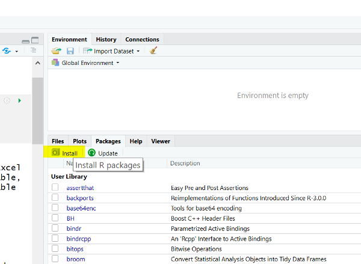

# Importing Data {#data}

You cannot do much of interest in R without data.  Typically, your data is stored in some kind of information system.  But, with a bit of skill and luck, you can typically export or extract  data into an Excel or a comma-separated value (.csv) file.  Of course, the data must be structured as a table, with rows and columns.  You may also have a header row, which contains the name of the variable in each column.

## Preliminaries

### Open an R script file

Although you can type commands directly into the R console (bottom-left pane in RStudio), you are better off creating a script file, which can be saved for future use. You execute the lines in the script interactively, either individually or in blocks.

1. Open R Studio and create a new R script file (hint: File -> New)
2. Save the script file.  It is good practice to save early and often.

### Executing code

Hitting the "Enter" key in a script file simply moves you to a new line. To execute a line of code from within a script file in the R Studio environment, you must do the following:

1. If you hit Control-Enter when your cursor is on a line of code, that line of code will be executed.
2. If you highlight a block of code and hit Control-Enter all the lines of code within the block will be executed.  Note that you have to highlight the whole block.  If you leave out a few characters you will get a cryptic error.
3. There is a little "Run" button at the top of the script window you can press in place of Control-Enter.

### Load the tidyverse package into R

As noted in Lesson \@ref(intro), the core R package can be extended with other packages.  For this to work, we have to do the following:

1. Download the other "library" package (this only has to be done once)
2. Load the package in the R environment so its special functions and commands can be used (this has to be done every time you want to use the package)

To download and install a package, simply use the install tool in RStudio:


The tidyverse is a collection of packages, so you can save yourself a bit of effort by installing the whole tidyverse collection instead of installing each component package individually.  Enter "tidyverse" into the search dialog and hit the install button. You will see lots of messages in the console window. If all goes well, the many components of the tidyverse will be installed on your machine.

To _use_ the tidyverse packages in your R scripts, you have to load them into the current R environment.  You can load the individual components of the tidyverse, or the whole thing at once. Regardless, you load a package by calling the `library` function at the top of your script:

```{r message=FALSE, warning=FALSE}
library(tidyverse)
```

You get a lot of output (and perhaps even some warnings) as all the _core_ components of the tidyverse are loaded: readr, ggplot2, dplyr, tidyr, etc. You can now call functions from any of these packages in your script.

### Assigning objects to variables

Like any programming language, R is based on _variables_.  A variable refers to a simple piece of data (e.g., x = 2) or something more complex, like a data frame in R (x = BankData).  One difference in R is that we use `<-` as the _assignment operator_ instead of `=` (though R will begrudgingly accept the equals sign).  The assignment operator assigns whatever is on the right of the operator to the variable on the left of the operator (hence the arrow).  Below we use it to assign the result of a data import function to a variable called "Bank".  We get to pick our own variable names, of course.  You could just as easily call the variable "bank", "bank.data", or "foo".  In general:

1. Avoid cryptic variable names that tell you nothing about their contents (e.g, X, x, i)
2. Avoid special characters like $, %, &, etc.
3. Use underscore (_) or period (.) instead of whitespace
4. To be safe, avoid names that are likely to be reserved in the language (e.g, "function", "matrix"", etc.). Variations like "MyFunction" or "bank.matrix" are fine, of course.

## Data frames and tibbles

A "data frame" is a data structure within R that exactly matches the rows and columns of your spreadsheet data (assuming your data is nicely structured into rows and columns).  A "tibble" is the tidyverse's incremental improvement on the data frame.  Tibbles (think "tables") are used by all tidyverse commands and functions, so the first step in any data analysis project is to use tidyverse functions to import your data as a tibble.

### Reading a CSV file

CSV is the most generic file type you will see.  It is a non-proprietary text file (human readable) in which the values are separated by commas (hence the name).  You can create a CSV file by exporting from Excel and most other program using File -> Save As.

To import the contents of a CSV file into the R environment as tibble, you use the assignment operator `<-` and the `read_csv` function from the tidyverse's "readr" package.  Here, I call my target tibble "Bank", but it could be just about any variable name.

````{r message=FALSE}
Bank <- read_csv("Data/Bank.csv")
```

Note that I need to know the path (either relative or absolute) to the CSV file on my computer.  If you want to save yourself some typing, you can use RStudio's "Import Dataset" tool and then copy the resulting `read_csv` statement into your script:

1. If you have not done so, create a CSV version of the Bank dataset by opening it in Excel and saving as CSV.
2. Click "Import Dataset" in the top-right panel of RStudio.


3. You will see two "Import Text" options: one for base R and the other from the "readr" library.  The readr library is part of the tidyverse, and since the tidyverse is installed (recall the installation step above), RStudio makes readr's import functionality available.
4. Select the readr version of "Import Text" and navigate to your CSV file.
5. Look at the console and note the `Bank <- read_csv("<...>/Bank.csv")` command. You can cut and paste this into your script.
6. The `View(Bank)` function call is added by RStudio. It simply shows your tibble in the RStudio viewer.  You can keep it open or close the tab.

### Reading an Excel file

Excel is a bit riskier because some open source programs refuse to play nice with proprietary file formats, such as Microsoft Excel.  That is where the tidyverse comes in: it provides R with ability to read Excel directly.  The only catch is that the "readxl" package is not part of the _core_ tidyverse and is not loaded when you run `library(tidyverse)`.  If you forget to load the readxl package explicitly in your script, R will assume a call to the `read_excel` function is a typo.

1. Redo the the "Import Dataset" steps from above, but choose "From Excel" instead of "From Text".
2. Select the Excel version of the bank dataset.

Note that the RStudio loads the "readxl" package for you.

3. You can change the name of the tibble ("dataset" by default) to anything you want.  I changed mine to "BankXL", so my import statement is `BankXL <- read_excel("<...>/Bank.xlsx")`.
4. Again, you can use `View(BankXL)` to view the contents of the tibble in RStudio's viewer.

## Using your data

The `View` function gives you a spreadsheet view your data.  You can also use the `glimpse` function from the "dplyr" package to get a text-oriented summary of your variables names, datatypes, and a few sample values. You should glimpse your data after importing data to make sure your datatypes imported correctly (numbers as numbers, text as text, dates as dates):

```{r}
  dplyr::glimpse(Bank)
```

Note: I used the function's full name: `<package name>::<function name>` above.  I don't _need_ to use the full name in this case because the tidyverse is loaded and no other package in my R environment has the name "glimpse".  However, the full name makes it clear to others (and my future self) that `glimpse` is not part of R, but is part of the dplyr package.

Alternatively, you can use the `summary` function to get a summary of each column in the data frame.  For each numeric column,`summary` provides a five-number summary (quartiles and mean).  For columns containing text (or "character" data), `summary` simply tells you the datatype.

```{r}
  summary(Bank)
```

## Factors versus character data

R is used for many types of data analysis, so the default in the tidyverse is to treat character data as character data---that is, to do nothing special with it.  Older R functions, in contrast, automatically convert character columns to "factors". A factor is just a statistical term for a categorical variable: a variable that takes on a fixed number of values, like {"red", "green", "blue"} or {"Chevy", "Honda", "Benz"}.  A factor is thus a special type of character data that R recognizes as distinct category names.  Factors can be very useful when doing traditional statistical analysis (which is what we will do here). 

In the bank data set, we have two legitimate categorical variables: PCJob={yes, no} and Gender={male, female}. We can convert these two columns to factors using the `as.factor` function:

```{r}
  Bank$PCJob <- as.factor(Bank$PCJob)
  Bank$Gender <- as.factor(Bank$Gender)
```

These lines might look complex, but they are really quite simple.  Consider the left-hand side of the first line of code:

1. The tibble (data frame) is called "Bank"
2. The column I want to update in the tibble is called "PCJob"
3. The full name of the column I want to update is thus: `Bank$PCJob`.  Note that this does not simply refer to a single value in the column.  It refers to the entire column---a vector of values.

__Q__: Why does R use $ instead of (say) a dot to separate the data frame and the column name?

__A__: Because.

The right-hand side of the assignment operator is similar.  It calls the function `as.factor` on the original PCJob column and returns it as a factor.  The assignment operator then replaces the original character column with the new factor column.  The rest of the tibble stays the same.

What is the advantage of this?  Re-run the `summary` function on the bank data and you will see that the summaries of the factors now show the frequencies for each value.  For example, the summary shows me that I have 140 females and 68 males in the data set:

```{r}
  summary(Bank)
```

 