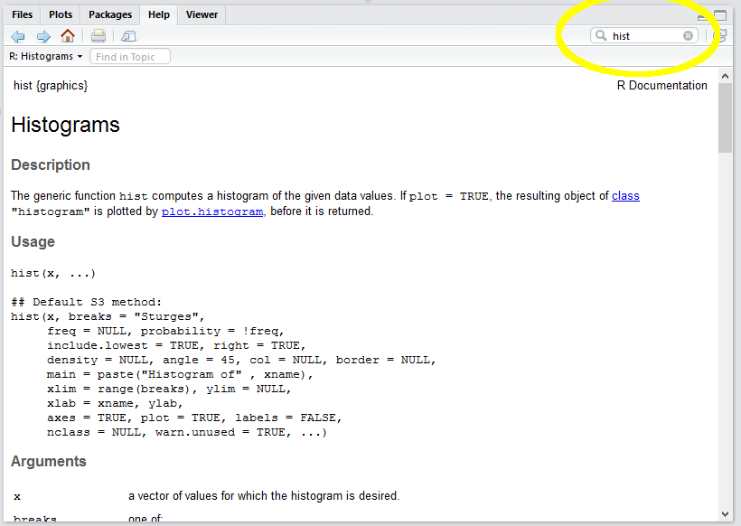

# Basic Visualization {#visualize}
```{r include=FALSE}
knitr::opts_chunk$set(echo = TRUE)
library(tidyverse)
Bank <- read_csv("Data/Bank.csv")
```

In this tutorial we create basic visualizations (histograms and box plots) using R.  The purpose of these basic visualizations is to see the _distribution_ of a particular variable.  The distribution helps us identify errors and potential outliers (with respect to our expectations about the data) and also suggests the very different underlying processes that lead to (say) a normal distribution versus a uniform distribution or some kind of fat-tailed distribution.

## Preliminaries

### Import the data into R Studio

Review Lesson \@ref(data) to recall how to import a dataset into R.  The result is a special type of data frame called a tibble.

### Use variables to save typing

Recall R's naming convention for the "Salary" column in the "Bank" tibble: `Bank$Salary`.  We can assign this column to a much shorter variable if we want to save ourselves some typing:

```{r}
  sal <- Bank$Salary
```

We can now run commands on the variable "sal" instead of "Bank\$Salary"

### Basic descriptive statistics

R is a statistics language.  As such, it has many features for extracting information from data. Type the following.  The results are denoted by ## in the output:

```{r}
min(sal)
max(sal)
mean(sal)
median(sal)
range(sal)
```

### R as a calculator

The R command line can execute simple (or complex) math.  For example, you might ask:

> How much does the hightest paid employee make compared to the median employee?

```{r}
max(sal)/median(sal)
```

## Histograms

Descriptive statistics are fine but a picture is worth a thousand words.

```{r}
hist(sal)
```

Think about this: in a handful characters `hist(sal)` you told R to transform a continuous variable (salary) into a histogram with an appropriate number of bins, frequency on the vertical axis, and basic axis labels.  This should give you some sense for why people who do this for a living prefer R to Excel.

### Basic formatting

You would never include the histogram above in a report for your boss without first formatting it.  R is not like Excel: you don't simply click on things and type in new values.  Everything must be set using the syntax of the programming language.  This approach does have some advantages, but they are unlikely to be apparent to you at this stage.

1. Edit the basic command by adding options:
    + set the main title with main="Distribution of Salaries"
    + set the x-axis label with xlab="Salary ($K)"
    + set the bar color with col="blue"
2. Notice the location of the commas (between options), quotation marks (around text), and the brackets in the expanded hist() command. If you understand this, you understand a big chunk of the R programming language:

```{r}
hist(sal,
     main="Distribution of Salaries",
     xlab="Salary ($K)",
     col="blue")
```

### Getting help

How did I know the option "main" allowed me to set the main title of the graphic?  Well, RStudio provides access to the R documentation.  I just typed in "hist" and it gave me the reference.




Such reference pages take a while to get used to.  If you find them incomprehensible you can search Google for "format histogram in R", or something like that.

## Going beyond

R is a very rich language and you can do just about anything if you know the tricks (or have infinite time and patience to Google and read).  Here are a few examples of things you **are not expected to do** but might find interesting.

### Density instead of frequency

By default the R histogram shows frequencies (in this case, _counts_ of bank employees within each salary bin).  As we will see, a relative measure is often more useful because it allows the comparison of histograms of two samples of different sizes.  R can show "density", which normalizes the plot so the area under the curve (or bars) equals 1.0:

1. Add the freq=FALSE option.
2. Note that FALSE is a predefined constant and does not take quotation marks.

```{r}
hist(sal,
     main="Distribution of Salaries",
     xlab="Salary ($K)",
     col="blue",
     freq=FALSE)
```

### Adding a kernel density line
You can overlay a kernel density line on your histogram (like SAS Enterprise Guide often does). A kernel density line is simply a smoothed linear representation of the histogram.  It shows the same distribution information in a different form:

Add the following to your script:
```{r eval=FALSE}
  lines(density(sal))
```

```{r echo=FALSE}
hist(sal, main="Distribution of Salaries",
    xlab="Salary ($K)",
    col="blue",
    freq=FALSE)
lines(density(sal))
```

### Adding a rug

A "rug" shows a tick along the horizontal axis for every data point. It provides much the same information as the histogram, but gives a better sense of where the extreme values are.

```{r eval=FALSE}
rug(sal)
```

```{r echo=FALSE}
hist(sal, main="Distribution of Salaries",
     xlab="Salary ($K)",
     col="blue",
     freq=FALSE)
rug(sal)
```

### Relative frequency (more advanced)

Finally, we may absolutely insist on showing _relative frequency_ rather than density. This insistence is not really rational since the units along the vertical axis of a histogram don't matter.  After all, the point of a histogram is to give a rough graphical impression of the distribution of the data.  It is easy to eye-ball the relative height of the bars without units.  The designers of R must agree with this because they make us jump through some hoops to show relative frequency.  I include this simply to show how R objects and their properties can be manipulated using the \<object name\>\$\<property name\> notation.

The steps are as follow:

1. Assign a histogram object to a variable (say `h`).  By default, the creation of a histogram triggers a plot so we use `plot=FALSE` to suppress the plot.
2. Extract the frequency (`count`) for each bin from the histogram object, `h`.  The `counts` property is exposed by the histogram object.
3. Calculate the percentage of the overall total for each bin.  This is the count for each bin divided by the total count.
4. Replace the histogram's density estimate with the percentage value.
5. Update the Y axis label to show "Percent" rather than density

```{r}
h <- hist(sal, plot=FALSE)
h$density = h$counts/sum(h$counts) * 100
plot(h, main="Distribution of Salaries",
     xlab="Salary ($K)",
     ylab="Percent",
     col="blue",
     freq=FALSE)
```

## Using ggplot

ggplot2 is a package in the tidyverse for creating very nice graphics---better than R's built-in graphics.  The downside of ggplot2's power is that you have to first learn a philosophy of visualization called [The Graphics of Grammar](https://www.amazon.com/Grammar-Graphics-Statistics-Computing/dp/0387245448/ref=as_li_ss_tl?ie=UTF8&qid=1477928463&sr=8-1&keywords=the+grammar+of+graphics&linkCode=sl1&tag=ggplot2-20&linkId=f0130e557161b83fbe97ba0e9175c431). The analogy to the grammar of a spoken language is fairly straightforward.  In a spoken language, we have nouns, verbs, adjectives, and so on, which can be strung together in certain ways to create meaning.  In the grammar of graphics, we have data, geometry (e.g., bars, lines, points), aesthetics (colors, shapes), and mapping.

To see how this works, we can re-create a histogram using the ggplot2 package:

```{r}
  library(ggplot2)  ## not necessary because we have already loaded the tidyverse
  ggplot(data=Bank) +
    geom_histogram(mapping=aes(x=Salary))
```

This syntax may look a bit odd. The basics of using ggplot are as follow:

1.  Call `ggplot(data=<tibble>)` to create an empty coordinate system.
2.  Use the plus sign to add layers.  The most important layer is a geometry layer (points, line, bars, and so on).  In this case, we use `geom_histogram`, which is a complex geometry that takes care of binning, etc. (like R's built-in `hist()` function)
3.  Each geometry function requires a mapping argument, which determines how columns in the data set are mapped to elements of the graph.
4.  The mapping argument calls the aesthetic function, `aes()` which sets the specifics of the mapping.

To see how the layers work, add a title (`ggtitle`) and X-axis label (`xlab`).  We can also pass some arguments to the geom_histogram function to change the appearance of the histogram itself:

```{r}
  ggplot(data=Bank) +
    geom_histogram(mapping=aes(x=Salary), bins=10, fill="blue") +
    ggtitle("Distribution of Salaries") +
    xlab("Salary ($K)")
```

Finally, the geom_histogram function in ggplot2 exposes some computed variables (like `h$counts` above) that can be used in the plot.  Here, the odd notation `..<variable name>..` is used to denote a built-in computed variable. By default, the Y axis of a histogram is the count of the observations in each bin.  We can change the y axis within the `aes()` function to density (a built-in computed variable) or relative frequency using the same arithmetic above:

``` {r eval=FALSE}
mapping=aes(x=Salary, y=..count..)  ## no change: y=..count.. is default`
mapping=aes(x=Salary, y=..density..)  ## shows density, as above in hist()`
mapping=aes(x=Salary, y=..count../sum(..count..)*100)  ## shows relative frequency`
```

So here is the ggplot version of the relative frequency histogram:

```{r}
ggplot(data=Bank) +
  geom_histogram(mapping=aes(x=Salary, y=..count../sum(..count..)*100), bins=10, fill="blue") +
  ggtitle("Distribution of Salaries") +
  xlab("Salary ($K)") +
  ylab("Percent")
```

Note that the percentages are slightly different from the `hist` version because the number of bins (and thus bin width) are different in the two histograms.  In `hist`, R uses "Sturges rule" to calculate a reasonable number of bins automatically; in the ggplot version I set the number of bins to 10 (following a warning to change it from the default of 30).

## Creating a box plot

As with a histogram, creating a very simple box plot requires only a single command:

```{r}
boxplot(sal)
```

This can be cleaned up using the same tricks as above:

```{r}
boxplot(sal, horizontal=TRUE,
        main="Distribution of Salaries",
        xlab="Salary ($K)")
```

This presentation makes potential outliers easy to spot.

ggplot also has a boxplot geometry, although it is really designed for doing side-by-side comparisons (we will see these later when we do visual gap analysis).  To trick it into showing a single variable without any comparisons, we set the x axis argument to an empty string "":

```{r}
  ggplot(data=Bank) +
    geom_boxplot(mapping=aes(x="", y=Salary))
```