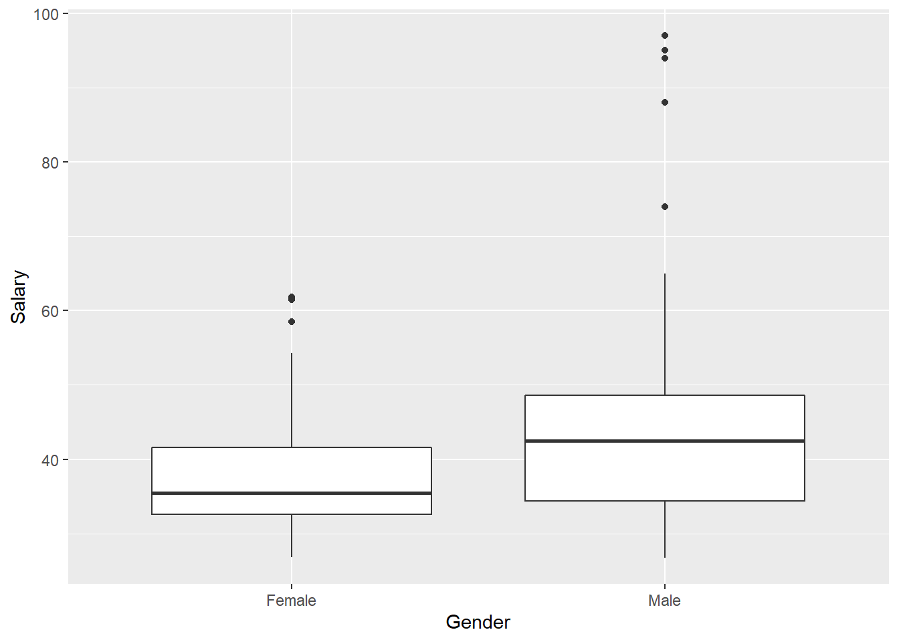
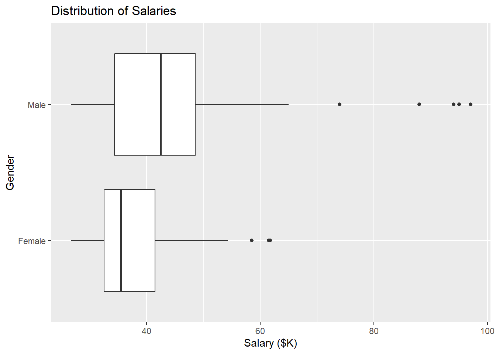
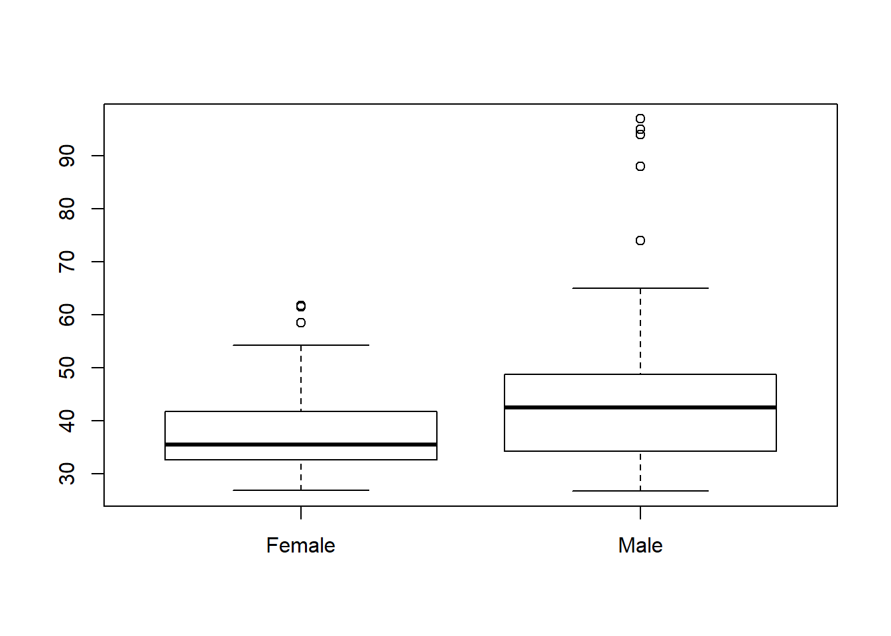
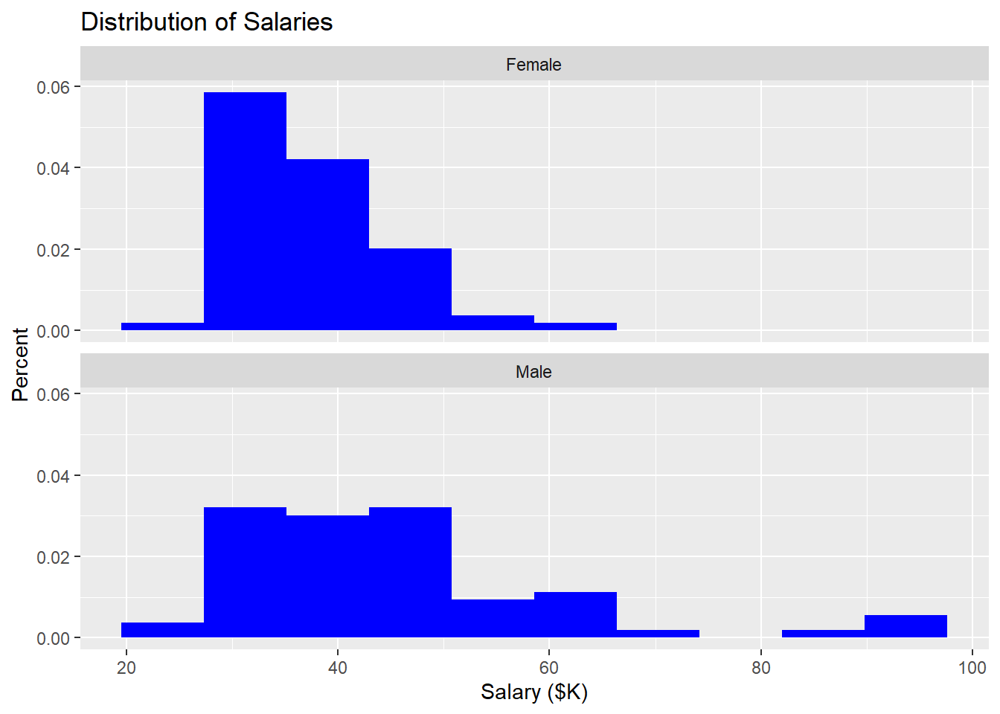
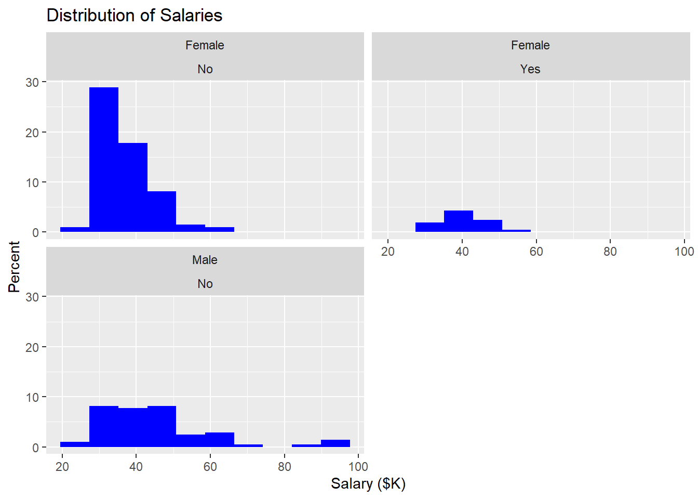
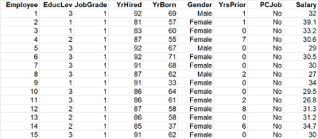
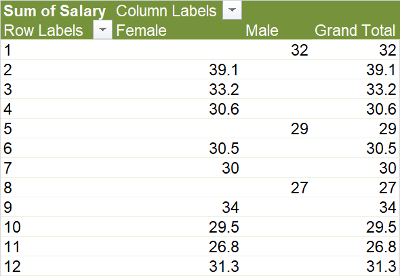

# Gap Analysis Using t-Tests {#ttest}

Here we are going to explore basic Gap Analysis in R. It shows different types of graphical gap analysis and concludes with the _t_-test.

Recall that the task is to determine whether there is a significant difference between the salaries of male and female employees at the bank.  We can thus think of this as two samples of continuous data:

* salaries for males
* salaries for females

The _null hypothesis_ is that both samples come from the same population. Translated, this means that we are testing the assumption that men and women are paid the same in the organization.

## Import the data into R Studio

By this point, I assume you recall how to get data into the RStudio environment.  See the [data tutorial](./data.html) for a reminder.


```r
library(tidyverse)
Bank <- read_csv("Data/Bank.csv")
```

## Visual gap analysis
### Boxplots in ggplot

Recall in Lesson \@ref(visualize) that the ggplot version of boxplot expects two axes: a measure (like Salary) and a grouping variable (like Gender).  Creating a comparative boxplot is thus extremely simple in ggplot:


```r
  ggplot(data=Bank) +
    geom_boxplot(mapping=aes(x=Gender, y=Salary))
```



If you are going to include the graphic in a report, you should add a title.  You can also make it horizontal using the `coord_flip` function (which flips the coordinate system in ggplot):


```r
  ggplot(data=Bank) +
    geom_boxplot(mapping=aes(x=Gender, y=Salary)) +
    ggtitle("Distribution of Salaries") +
    ylab("Salary ($K)") +
    coord_flip()
```



### Boxplots in base R (and formula notation)

We can accomplish much the same thing in base R---that is, without using the ggplot2 package.  The key is R's "formula" notation, which we will see in other, non-graphical contexts.  The format of a formula in R is: `Y ~ X`  This can be read as: "Y is a function of X".  The notation defines a relationship between the variables that certain functions can understand.

To illustrate, consider the case here:  We are trying to understand if Salary depends on Gender.  We can write this (hypothesized) relationship as `Salary ~ Gender`.


```r
boxplot(Salary ~ Gender, Bank)
```



Here we call the `boxplot` function with two arguments: the formula followed by the source data (our Bank tibble).  R reads the formula and understands we want to see how Salary varies with the different values of Gender.

As an aside, you may be wondering why I used the `data=Bank` argument rather than a pipe.  The following does not work in R because the boxplot function is part of base R, not the tidyverse.  Pipes only work in the tidyverse, not all parts of R.


```r
  Bank %>% boxplot(Salary ~ Gender) ## does not work
```

### Histograms

Comparative histograms in base R are possible, but very complex. In contrast, ggplot allows us to extend our basic histogram (recall the [visualization tutorial](visualize)) with _facets_.  To illustrate, recall the basic histogram for all bank employees:


```r
  ggplot(data=Bank) +
    geom_histogram(mapping=aes(x=Salary, y=..count../sum(..count..)* 100), bins=10, fill="blue") +
    ggtitle("Distribution of Salaries") +
    xlab("Salary ($K)") +
    ylab("Percent")
```


To this we can add a facet with two arguments:  The formula argument says "as a function of Gender" and the number of rows argument allows us to stack the histograms, as in SAS:


```r
  ggplot(data=Bank) +
  geom_histogram(mapping=aes(x=Salary, y=..density..), bins=10, fill="blue") +
  ggtitle("Distribution of Salaries") +
  xlab("Salary ($K)") +
  ylab("Percent") +
  facet_wrap( ~ Gender, nrow=2)
```



The result is two histograms: one for males and the other for females.  Naturally, for this to work, the "as a function of" variable has to be discrete (like Gender).

Can the formula be more complex? Yes. We can look at the distribution of Salary as a function of Gender and PCJob (the other discrete variable in the Bank tibble) by writing the formula as `Y ~ Gender + PCJob`.  Note that we get a salary histogram for each combination of the two variables.  One quadrant is missing because, apparently, there are no males with PC jobs in this bank:


```r
ggplot(data=Bank) +
  geom_histogram(mapping=aes(x=Salary, y=..count../sum(..count..)*100), bins=10, fill="blue") +
  ggtitle("Distribution of Salaries") +
  xlab("Salary ($K)") +
  ylab("Percent") +
  facet_wrap(~ Gender + PCJob, nrow=2)
```



## _t_-test

As always, there is a slight difference in the _t_-test arithmetic depending on whether we assume the two samples have equal variance.  SAS Enterprise Guide runs both versions of the _t_-test and includes the equality of variance test so you know which version to use.  R is a bit more like Excel: you have to run your own equality of variance test and then, based on the result, select the correct version of the _t_-test to run.

### Columns or formulas?

Before getting into the equality of variance test, it is worth reviewing the difference between stacked and unstacked data.

Recall that stacked (or "long" or "tidy") data has a single column for Salary. This is the format in which we most often get data from databases and business software.




If the data is unstacked (or "pivoted" or converted to "wide data"), we get a Salary column for each value of Gender:




R and the tidyverse include tools for _reshaping_ data.  The `spread` function is similar to using a pivot table in Excel to make wide data; the `gather` function does something Excel cannot do: un-pivot data back into long format.

Which data shape is better? Excel's Analysis TookPak uses unstacked/pivoted data for most comparisons.  This makes sense to most people: You start with two columns of data (salary for females and salary for males) and you run tests that compare the two columns.  This approach is a lot of work, but it is conceptually simple.

### Equality of variance test (columns)

Let's start with the simplest (but least elegant approach):

1.  Create two new tibbles: Bank.female and Bank.male.  These are copies of the original Bank tibble in which male and females have been filtered out.
2.  Run the equality of variance test on the Salary columns from the two different tibbles.

First, the new tibbles:

```r
  Bank.male <- Bank %>% filter(Gender=="Male")
  Bank.female <- Bank %>% filter(Gender=="Female")
```

Note that this works just as well without pipes `%>%`.  You simply need include the data source as the first argument in `filter`:


```r
  Bank.male <- filter(Bank, Gender=="Male")
  Bank.female <- filter(Bank, Gender=="Female")
```

Now, we can run the equality of variance test:

```r
  var.test(Bank.female$Salary, Bank.male$Salary)
```

```
## 
## 	F test to compare two variances
## 
## data:  Bank.female$Salary and Bank.male$Salary
## F = 0.17942, num df = 139, denom df = 67, p-value < 2.2e-16
## alternative hypothesis: true ratio of variances is not equal to 1
## 95 percent confidence interval:
##  0.1166790 0.2676276
## sample estimates:
## ratio of variances 
##          0.1794198
```

All we are interested in from this output is whether the two variances are equal.  The _null hypothesis_ in this test is that the variances are equal.  Thus, the small _p_-value (2.2e-16)---the probability that the null hypothesis is true---suggest they are _unequal_.

### Equality of variance test (pivoted columns)

The idea of splitting the Bank data into separate female and male tibbles hopefully strikes you as a bit inelegant.  In Excel, we used a pivot table to sidestep the need to copy and filter data.  We can do the same here using the `spread` function:


```r
  Bank.gender <- Bank %>% spread(key=Gender, value=Salary)
  View(Bank.gender)  ## examine the pivoted result
  var.test(Bank.gender$Female, Bank.gender$Male)
```

```
## 
## 	F test to compare two variances
## 
## data:  Bank.gender$Female and Bank.gender$Male
## F = 0.17942, num df = 139, denom df = 67, p-value < 2.2e-16
## alternative hypothesis: true ratio of variances is not equal to 1
## 95 percent confidence interval:
##  0.1166790 0.2676276
## sample estimates:
## ratio of variances 
##          0.1794198
```

### Equality of variance test (formula)

Pivoting the data before comparing columns is a bit better, but we still had to create an entirely new tibble ("Bank.gender"") with separate Female and Male salary columns.  Fortunately, the _formula_ notation discussed previously allows us to use stacked data without any requirement to extract separate columns for females and males.


```r
  var.test(Salary ~ Gender, Bank)
```

```
## 
## 	F test to compare two variances
## 
## data:  Salary by Gender
## F = 0.17942, num df = 139, denom df = 67, p-value < 2.2e-16
## alternative hypothesis: true ratio of variances is not equal to 1
## 95 percent confidence interval:
##  0.1166790 0.2676276
## sample estimates:
## ratio of variances 
##          0.1794198
```

Again, the formula "Salary as a function of Gender" is the first argument and the source data is the second argument.  As we see, the result is identical to the previous two tests, but with much less work. The formula tells R to split Salary according to the two different values for Gender in the data set.  This is similar to the "Classification variable" in SAS Enterprise Guide.

If we had more than two values for Gender, we would have to use a different statistical technique (such as ANOVA).

### Unequal variance _t_-test

We are now ready to move onto the main event.  The only reason we care whether the variances of male and female salaries are equal is to know which version of the _t_-test to run. In this case, the small probability that the variances are equal leads us to the conclusion that the variances are unequal.  We pass this information along to the `t.test` function using the `var.equal` argument:


```r
t.test(Salary ~ Gender, Bank, var.equal=FALSE)
```

```
## 
## 	Welch Two Sample t-test
## 
## data:  Salary by Gender
## t = -4.141, df = 78.898, p-value = 8.604e-05
## alternative hypothesis: true difference in means is not equal to 0
## 95 percent confidence interval:
##  -12.282943  -4.308082
## sample estimates:
## mean in group Female   mean in group Male 
##             37.20993             45.50544
```

The _p_-value (the probability the sample means are the same) is small (8.604e-05).  In addition, R gives us the very useful confidence interval around the difference of the two means.  So we are 95% certain that we pay women somewhere between 12K and 4.3K less than men.
