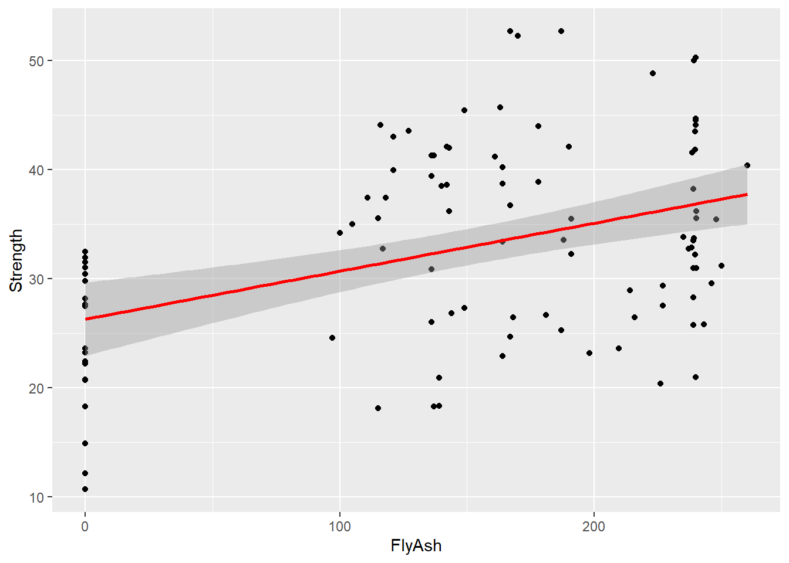
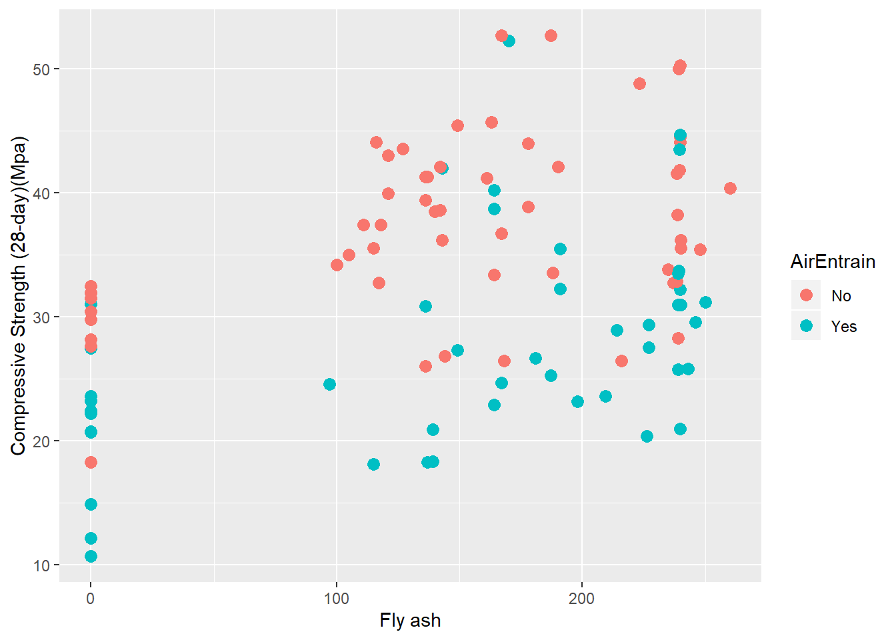
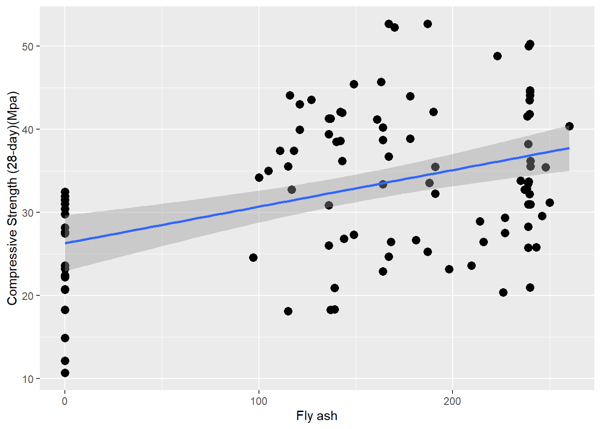

# Correlation and Scatterplots {#correlation}

In this tutorial we begin our investigation of multivariate statistics using correlation and scatterplots.  The idea is that we have two _continuous_ variables and we want to examine the strength of the (linear) relationship between them.

## Data
The data for this is the concrete strength data. Load the data in the normal way to a data frame with a manageable name:


```r
library(tidyverse)
Con <- read_csv("Data/ConcreteStrength.csv")
```

Recall that some of the column names in the concrete strength Excel file are on the long side. Moreover, the column names contain spaces, parentheses, and dots.  All these are problematic in the long run:


```r
  colnames(Con)
```

```
##  [1] "No"                                
##  [2] "Cement"                            
##  [3] "Slag"                              
##  [4] "Fly ash"                           
##  [5] "Water"                             
##  [6] "SP"                                
##  [7] "Coarse Aggr."                      
##  [8] "Fine Aggr."                        
##  [9] "Air Entrainment"                   
## [10] "Compressive Strength (28-day)(Mpa)"
```

The easiest fix is to edit your Excel column names before importing.  Another approach it to use dplyr's `rename` function to assign better names to columns after importing:


```r
  Con <- Con %>% dplyr::rename(Strength = "Compressive Strength (28-day)(Mpa)",
       FlyAsh = "Fly ash",
       CoarseAgg = "Coarse Aggr.",
       FineAgg = "Fine Aggr.",
       AirEntrain = "Air Entrainment")
```

Note the syntax for the `rename` function is \<new name\> = \<old name\>.  Since the original names contain spaces, I have to use quotes around them.

## Scatterplots

Assume we want to better understand the relationship between the amount of fly ash in the concrete and its compressive strength.  A first step is to plot the two variables.


```r
ggplot(Con, mapping=aes(x=FlyAsh, y=Strength)) +
  geom_point() +
   stat_smooth(method = "lm", col = "red")
```

```
## `geom_smooth()` using formula 'y ~ x'
```



The scatterplot shows a relatively weak (though upward) relationship between the two variables.  

Of course, since this is a ggplot, we can do much more with it.  Below I make it prettier by adding labels.  In addition, I add another dimension (the value of AirEntrain) and map it to color.  I make the data points a bit larger so they are easier to see:


```r
ggplot(Con, mapping=aes(x=FlyAsh, y=Strength, color=AirEntrain)) +
  geom_point(size=3) +
  ylab("Compressive Strength (28-day)(Mpa)") +
  xlab("Fly ash")
```




Finally, I can add a best-fit line to the scatterplot.  The default is to show the 95% confidence limits around the line, but I can turn these off using the `se=FALSE` argument.   I remove the color dimension so I do not get two best fit lines (one for each value of AirEntrain):


```r
ggplot(Con, mapping=aes(x=FlyAsh, y=Strength)) +
  geom_point(size=3) +
  ylab("Compressive Strength (28-day)(Mpa)") +
  xlab("Fly ash") +
  geom_smooth(method=lm, se=TRUE)
```

```
## `geom_smooth()` using formula 'y ~ x'
```



## Coefficient of correlation

### Simple correlation

We can calculate a coefficient of correlation for our two variables:

```r
  cor(Con$Strength, Con$FlyAsh)
```

```
## [1] 0.406387
```

Recall the the correlation coefficient ranges from -1 (perfect negative correlation) to +1 (perfect positive correlation).  A correlation of _r_ = 0 indicates no linear relationship between the variable. 

The `cor.test` command is similar but provides more information, including 95% confidence intervals around the correlation coefficient:

```r
  cor.test(Con$Strength, Con$FlyAsh)
```

```
## 
## 	Pearson's product-moment correlation
## 
## data:  Con$Strength and Con$FlyAsh
## t = 4.4699, df = 101, p-value = 2.05e-05
## alternative hypothesis: true correlation is not equal to 0
## 95 percent confidence interval:
##  0.2310321 0.5561711
## sample estimates:
##      cor 
## 0.406387
```

The coefficient of correlation is 0.41-ish.  This is not particularly strong and corresponds to what we see in the scatterplot.  However, using the confidence intervals on this estimate, we can be relatively certain that the correlation is between 0.23 and 0.56 (i.e., not zero).

### Correlation matrix

We can examine _all_ the pairwise correlation coefficients in the concrete data by running the `cor` function on the Con tibble.  The only complication is that AirEntrain is not numeric, and thus gums everything up.  Below I use a series of pipes to:

1.  Select all columns _except_ No and AirEntrain.
2.  Calculate the correlation matrix.
3.  Round the coefficients so the matrix is easier to read.


```r
  Con %>% select(-AirEntrain, -No) %>% cor %>% round(2)
```

```
##           Cement  Slag FlyAsh Water    SP CoarseAgg FineAgg Strength
## Cement      1.00 -0.24  -0.49  0.22 -0.11     -0.31    0.06     0.46
## Slag       -0.24  1.00  -0.32 -0.03  0.31     -0.22   -0.18    -0.33
## FlyAsh     -0.49 -0.32   1.00 -0.24 -0.14      0.17   -0.28     0.41
## Water       0.22 -0.03  -0.24  1.00 -0.16     -0.60    0.11    -0.22
## SP         -0.11  0.31  -0.14 -0.16  1.00     -0.10    0.06    -0.02
## CoarseAgg  -0.31 -0.22   0.17 -0.60 -0.10      1.00   -0.49    -0.15
## FineAgg     0.06 -0.18  -0.28  0.11  0.06     -0.49    1.00    -0.17
## Strength    0.46 -0.33   0.41 -0.22 -0.02     -0.15   -0.17     1.00
```
