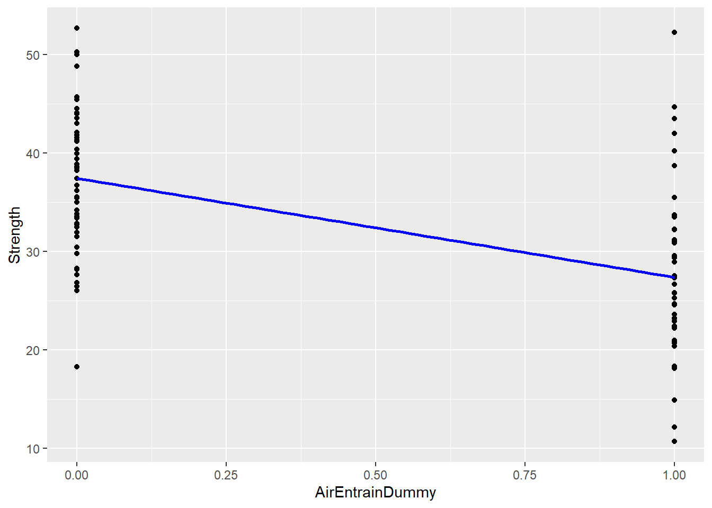
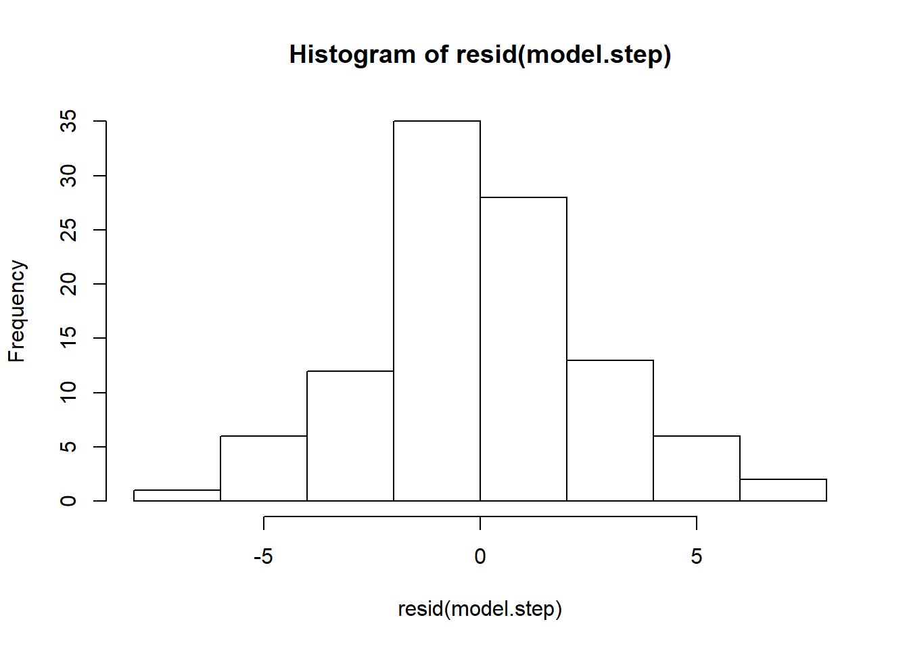
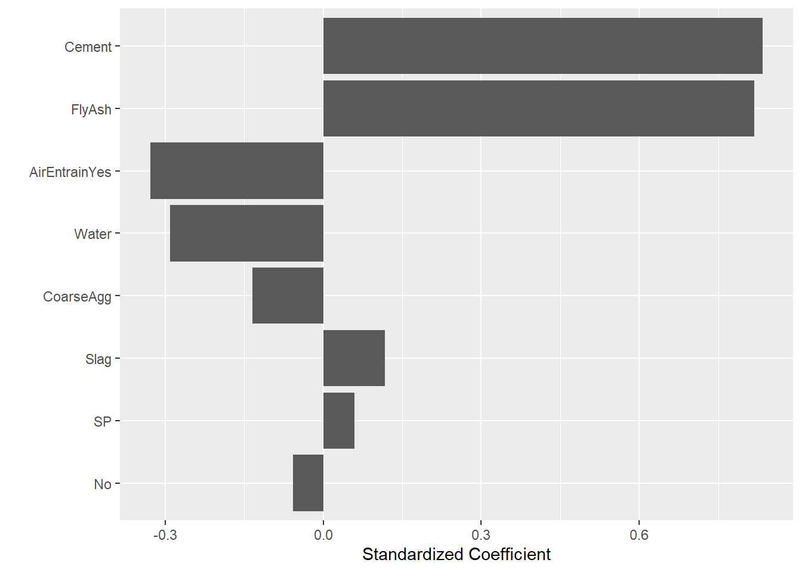

# Multiple Linear Regression {#multiregression}

The purpose of this tutorial is to continue our exploration of regression by constructing linear models with two or more explanatory variables. This is an extension of Lesson \@ref(regression).


## Kitchen sink model
We can extend the `lm(y~x)` function to construct a more complicated "formula" for the multi-dimensional model: `lm(y ~ x1 + x2 + ... + xn )`.  This tells R to find the best model in which the response variable `y` is a linear function of a set of explanatory variables x1, x2, and so on.

I will start with a model I call "model.ks" (to denote an "everything including the kitchen sink" approach to variable selection).  Note that I do not include AirEntrain in this model because it is categorical:


```r
model.ks <- lm(Strength ~ No + Cement + Slag + Water + CoarseAgg + FlyAsh + SP + FineAgg, data=Con)
summary(model.ks)
```

```
## 
## Call:
## lm(formula = Strength ~ No + Cement + Slag + Water + CoarseAgg + 
##     FlyAsh + SP + FineAgg, data = Con)
## 
## Residuals:
##     Min      1Q  Median      3Q     Max 
## -10.307  -2.831   0.502   2.806   8.577 
## 
## Coefficients:
##               Estimate Std. Error t value Pr(>|t|)  
## (Intercept) 115.283443 142.786273   0.807    0.421  
## No           -0.007705   0.020713  -0.372    0.711  
## Cement        0.082580   0.046976   1.758    0.082 .
## Slag         -0.022513   0.065139  -0.346    0.730  
## Water        -0.216471   0.142461  -1.520    0.132  
## CoarseAgg    -0.047911   0.055876  -0.857    0.393  
## FlyAsh        0.066842   0.048425   1.380    0.171  
## SP            0.251812   0.213277   1.181    0.241  
## FineAgg      -0.035626   0.057300  -0.622    0.536  
## ---
## Signif. codes:  0 '***' 0.001 '**' 0.01 '*' 0.05 '.' 0.1 ' ' 1
## 
## Residual standard error: 4.01 on 94 degrees of freedom
## Multiple R-squared:  0.8271,	Adjusted R-squared:  0.8124 
## F-statistic: 56.21 on 8 and 94 DF,  p-value: < 2.2e-16
```

As we should expect, this result is identical to the kitchen sink model in Excel (R^2^ = 0.8271).

## Categorical explanatory variables
Recall the "air entrainment" variable in the concrete data set:


```r
summary(Con$AirEntrain)
```

```
##    Length     Class      Mode 
##       103 character character
```

AirEntrain is a categorical (yes/no) variable and cannot be used in regression without transforming it to a numerical {0,1} dummy/indicator variable.  We can use our recoding skills from Lesson \@ref(recode) to do this manually, or (as you will see below), we can let R take care of dummy coding for us.

Before we do this, recall the discussion in Lesson \@ref(data) about the difference between character variables and _factors_.  We want to treat AirEntrain as a factor (categorical variable) with a finite set of values.  Since the tidyverse does not automatically convert character variables to factors, we must do it explicitly.  Below I use the dplyr `mutate` function to replace AirEntrain with the factor version:


```r
Con <- Con %>% mutate(AirEntrain = as_factor(AirEntrain))
summary(Con$AirEntrain)
```

```
##  No Yes 
##  56  47
```

Now that AirEntrain is a factor, I can include it in the regression and R will take care of recoding it as a dummy variable:


```r
model.ks <- lm(Strength ~ No + Cement + Slag + Water + CoarseAgg + FlyAsh + SP + FineAgg + AirEntrain, data=Con)
summary(model.ks)
```

```
## 
## Call:
## lm(formula = Strength ~ No + Cement + Slag + Water + CoarseAgg + 
##     FlyAsh + SP + FineAgg + AirEntrain, data = Con)
## 
## Residuals:
##    Min     1Q Median     3Q    Max 
## -6.188 -1.548 -0.017  1.277  7.975 
## 
## Coefficients:
##                Estimate Std. Error t value Pr(>|t|)    
## (Intercept)   41.500508  95.616675   0.434  0.66527    
## No            -0.017346   0.013864  -1.251  0.21401    
## Cement         0.096195   0.031403   3.063  0.00286 ** 
## Slag           0.015681   0.043652   0.359  0.72023    
## Water         -0.138011   0.095431  -1.446  0.15149    
## CoarseAgg     -0.016038   0.037438  -0.428  0.66935    
## FlyAsh         0.086950   0.032399   2.684  0.00862 ** 
## SP             0.190158   0.142572   1.334  0.18554    
## FineAgg       -0.002053   0.038399  -0.053  0.95748    
## AirEntrainYes -6.068252   0.559372 -10.848  < 2e-16 ***
## ---
## Signif. codes:  0 '***' 0.001 '**' 0.01 '*' 0.05 '.' 0.1 ' ' 1
## 
## Residual standard error: 2.679 on 93 degrees of freedom
## Multiple R-squared:  0.9237,	Adjusted R-squared:  0.9163 
## F-statistic: 125.1 on 9 and 93 DF,  p-value: < 2.2e-16
```

You can see in the table of coefficients that a new variable called "AirEntrainYes" has been added to the model automatically.  R adds the "Yes" suffix to remind us that the original values of AirEntrain have been mapped to "Yes" = 1.  There is no "AirEntrainNo" variable because "No" has been selected as the base-case (when AirEntrainYes = 0).

We can isolate AirEntrain and show this visually:


```r
ggplot(data=Con %>% mutate(AirEntrainDummy = if_else(AirEntrain=="Yes", 1, 0))
       , mapping=aes(x=AirEntrainDummy, y=Strength)) +
  geom_point() +
  geom_smooth(method=lm,  col="blue", se=FALSE)
```

```
## `geom_smooth()` using formula 'y ~ x'
```



Here, I have had to manually create a temporary AirEntrainDummy variable in order to get the regression line to plot correctly.  But you can see the basic idea: Each measure of concrete strength  falls on either the AirEntrainDummy = 0 or the AirEntrainDummy = 1 tick mark.  It turns out that the mean of the points at AirEntrainDummy = 0 is higher than then mean of the points at AirEntrainDummy = 1.  As such, the best-fit line slopes downwards.  This is what the negative coefficient for the AirEntrainYes variable tells us: adding air leads to an average _decrease_ in strength of -6.068252.

To summarize categorical variables:

1.  You should convert categorical variables to factors.
2.  If you want fine-grained controlled over base-cases and the naming of dummy variables, you should create your dummy variables manually (see the `if_else` example above).
3.  Alternatively, you can let R create _n_-1 dummy variables for you automatically, where _n_ is the number of "levels" (or unique values) of the source factor.

You will likely find approach (2) to be the most useful in practice because, in many cases, you will want to change the granularity of your categorical variables.  A regression equation with a zillion dummy variables in it is hard to read and has little generalizable business value.

For example, instead of having a factor "city" with many different levels/values {West Vancouver, North Vancouver, Chilliwack, Kelowna, Prince George, ...}, it might be better to group cities by region {North, Metro Vancouver, Interior, ...}.  This is what I mean by changing granularity.

## Checking for colinearity
### Scatterplot matrix
Recall that we use SAS's scatterplot matrix feature to quickly scan for pairs of explanatory variables that might be colinear.  To do this in R we must first make sure we limit our data frame to numerical variables (the regression function creates dummies automatically, but AirEntrain remains a categorical variable). To do this, I use dplyr's `select_if` function.  It only returns columns for which a logical condition is true.  R's `is.numeric` function returns TRUE if the column is numeric.


```r
Con %>% dplyr::select_if(is.numeric) %>% head  ## demonstrate the use of the select_if filter
```

```
## Warning: `...` is not empty.
## 
## We detected these problematic arguments:
## * `needs_dots`
## 
## These dots only exist to allow future extensions and should be empty.
## Did you misspecify an argument?
```

```
## # A tibble: 6 x 9
##      No Cement  Slag FlyAsh Water    SP CoarseAgg FineAgg Strength
##   <dbl>  <dbl> <dbl>  <dbl> <dbl> <dbl>     <dbl>   <dbl>    <dbl>
## 1     1    273    82    105   210     9       904     680     35.0
## 2     2    163   149    191   180    12       843     746     32.3
## 3     3    162   148    191   179    16       840     743     35.4
## 4     4    162   148    190   179    19       838     741     42.1
## 5     5    154   112    144   220    10       923     658     26.8
## 6     6    147    89    115   202     9       860     829     18.1
```

```r
pairs(Con %>% dplyr::select_if(is.numeric))
```


### Correlation matrix
Unfortunately, scatterplot matrices can be hard to read if you have too many variables.  You can generate a simple correlation matrix instead and scan for high correlations (close to -1 or +1).  It is not as visual, but it works. I pipe the results though the `round` function to make the matrix more readable:


```r
cor(Con %>% dplyr::select_if(is.numeric)) %>% round(2)
```

```
##              No Cement  Slag FlyAsh Water    SP CoarseAgg FineAgg Strength
## No         1.00  -0.03 -0.08   0.34 -0.14 -0.33      0.22   -0.31     0.19
## Cement    -0.03   1.00 -0.24  -0.49  0.22 -0.11     -0.31    0.06     0.46
## Slag      -0.08  -0.24  1.00  -0.32 -0.03  0.31     -0.22   -0.18    -0.33
## FlyAsh     0.34  -0.49 -0.32   1.00 -0.24 -0.14      0.17   -0.28     0.41
## Water     -0.14   0.22 -0.03  -0.24  1.00 -0.16     -0.60    0.11    -0.22
## SP        -0.33  -0.11  0.31  -0.14 -0.16  1.00     -0.10    0.06    -0.02
## CoarseAgg  0.22  -0.31 -0.22   0.17 -0.60 -0.10      1.00   -0.49    -0.15
## FineAgg   -0.31   0.06 -0.18  -0.28  0.11  0.06     -0.49    1.00    -0.17
## Strength   0.19   0.46 -0.33   0.41 -0.22 -0.02     -0.15   -0.17     1.00
```


## Model refinement
### Manual stepwise refinement
As in Excel, we can manually remove explanatory variables one-by-one until we have a model in which all the explanatory variables are significant. This is the essence of data-driven (versus theory driven) model refinement. 

The heuristic we used in Excel for refinement is to remove the variable with the highest _p_-value (meaning that its slope has the highest probability of being zero). In model.ks, we could start by removing fine aggregates because its _p_-value is 0.95748. We then re-run the model and determine if we still have any non-significant coefficients.

This iterative process is somewhat easier in  R than Excel because we simply cut-and-paste the equation, delete a variable name, and re-run the `lm()` function.

### Automated stepwise refinement
Like SAS, R has several approaches to automatic model refinement.  By default the `step` function uses a bi-directional AIC-based heuristic (that is, it removes and adds variables based on values of the Akaike information criterion).  It is conceptually similar to the Mallows Cp-based heuristic favored by the SAS elearning materials.  We do not need to understand these heuristics in depth to use them.  However, we should appreciate that different algorithms may yield slightly different final models.


```r
model.step <- step(model.ks)
```

```
## Start:  AIC=212.45
## Strength ~ No + Cement + Slag + Water + CoarseAgg + FlyAsh + 
##     SP + FineAgg + AirEntrain
## 
##              Df Sum of Sq     RSS    AIC
## - FineAgg     1      0.02  667.28 210.45
## - Slag        1      0.93  668.18 210.59
## - CoarseAgg   1      1.32  668.57 210.65
## - No          1     11.23  678.49 212.17
## - SP          1     12.76  680.02 212.40
## <none>                     667.26 212.45
## - Water       1     15.01  682.26 212.74
## - FlyAsh      1     51.68  718.93 218.13
## - Cement      1     67.33  734.58 220.35
## - AirEntrain  1    844.38 1511.63 294.68
## 
## Step:  AIC=210.45
## Strength ~ No + Cement + Slag + Water + CoarseAgg + FlyAsh + 
##     SP + AirEntrain
## 
##              Df Sum of Sq     RSS    AIC
## <none>                     667.28 210.45
## - No          1     19.89  687.17 211.48
## - SP          1     22.76  690.04 211.91
## - Slag        1     56.43  723.71 216.81
## - CoarseAgg   1     62.38  729.66 217.66
## - Water       1    360.96 1028.24 252.99
## - AirEntrain  1    850.57 1517.85 293.10
## - FlyAsh      1   2141.06 2808.33 356.48
## - Cement      1   2318.00 2985.28 362.77
```

```r
summary(model.step)
```

```
## 
## Call:
## lm(formula = Strength ~ No + Cement + Slag + Water + CoarseAgg + 
##     FlyAsh + SP + AirEntrain, data = Con)
## 
## Residuals:
##     Min      1Q  Median      3Q     Max 
## -6.1972 -1.5293 -0.0321  1.2833  7.9801 
## 
## Coefficients:
##                Estimate Std. Error t value Pr(>|t|)    
## (Intercept)   36.409657   8.674414   4.197 6.13e-05 ***
## No            -0.017817   0.010643  -1.674  0.09744 .  
## Cement         0.097848   0.005415  18.070  < 2e-16 ***
## Slag           0.017990   0.006381   2.819  0.00587 ** 
## Water         -0.133008   0.018652  -7.131 2.03e-10 ***
## CoarseAgg     -0.014053   0.004741  -2.964  0.00384 ** 
## FlyAsh         0.088660   0.005105  17.367  < 2e-16 ***
## SP             0.195040   0.108925   1.791  0.07658 .  
## AirEntrainYes -6.070662   0.554587 -10.946  < 2e-16 ***
## ---
## Signif. codes:  0 '***' 0.001 '**' 0.01 '*' 0.05 '.' 0.1 ' ' 1
## 
## Residual standard error: 2.664 on 94 degrees of freedom
## Multiple R-squared:  0.9237,	Adjusted R-squared:  0.9172 
## F-statistic: 142.2 on 8 and 94 DF,  p-value: < 2.2e-16
```

As one might expect, the _adjusted_ R^2^ has gone up slightly relative to the kitchen sink model.

## Regression diagnostics
Finally, we should examine the residuals and overall fit for the refined model:


```r
hist(resid(model.step))
```



```r
boxplot(resid(model.step), horizontal=TRUE)
```


```r
qqnorm(resid(model.step))
qqline(resid(model.step))
```


```r
plot(fitted(model.step), Con$Strength, xlab="predicted value", ylab="observed value")
  abline(0, 1)
```


## Standardized regression coefficients
Recall the interpretation of the coefficients:  "A one unit change in variable $X_i$ is associated with a $\beta_i$ change in the response variable."  So here, a one unit change in Cement is associated with a 0.097848 change in Strength.  Whether 0.097848 is big or small depends critically on the units used for the Cement variable.  If the "one unit change" is measured in grams, then 0.097848 is likely a large effect.  In contrast, if a one unit change is measured in metric tonnes, then the effect on strength is much smaller.

The bottom line is this:  You cannot meaningfully compare the size of the regression coefficients to assess the _most important_ effect---it is an apples-and-oranges comparison.  _Standardized_ regression coefficients are a different matter.  A standardized regression coefficient is created by transforming all variables in the model to have a mean of zero and a standard deviation of 1.0.  This allows the standardized coefficients to be interpreted as follows: "A one standard deviation change in variable $X_i$ is associated with a $\beta_i$ standard deviation change in the response variable".  All this talk of "standard deviation changes" means units do not matter.  Standardized regression coefficients are difficult to translate into business terms, but they are directly comparable.  This allows you to determine which variables in your final model are really driving the variation in your response variable.

### Extracting betas
I have been sloppy with notation in these tutorials:  I have used $\beta_i$ to denote regression coefficients when I should have used $B$.  Traditionally, the Greek $\beta$ is used to denote the _standardized_ coefficient.  For this reason, the package that supplies standardized coefficients is called `lm.beta`.  The package is not part of base R, but is found in the "QuantPsyc" library.  You must install this library in RStudio before loading the library (recall the package installation instructions in the [data](./data.html) tutorial.


```r
library(QuantPsyc)
model.std <- lm.beta(model.step)
model.std  ## show the vector of results
```

```
##            No        Cement          Slag         Water     CoarseAgg 
##   -0.05749766    0.83361908    0.11748155   -0.29031355   -0.13416672 
##        FlyAsh            SP AirEntrainYes 
##    0.81797381    0.05914383   -0.32818794
```

### Tornado diagram
A good way to visualize standardized coefficients is as a sorted bar chart known as a tornado diagram:


```r
library(broom)  ## needed for tidy call
tidy(model.std) %>% ggplot() +
  geom_col(mapping=aes(x=reorder(names, abs(x)), y=x)) + 
  xlab("") +
  ylab("Standardized Coefficient") +
  coord_flip()
```



Here I have to first convert the vector of results into a tibble before piping to ggplot.  The `reorder` call sorts the x-axis (variable names) according to absolute value of their standardized coefficient.  The result resembles a tornado (hence the name).  It is easy to tell at a glance that both Cement and FlyAsh have a large positive impact on Strength, whereas Water and AirEntrain have a less important negative impact (i.e., more water leads to lower strength).  Note that this tornado does not show the statistical significance of the coefficients.  We assume after refining our model using the `step` function that all the coefficients are significant (or at least worth keeping).  The tornado diagram shows the relative size of the effect, which is critical to understanding root causes.
